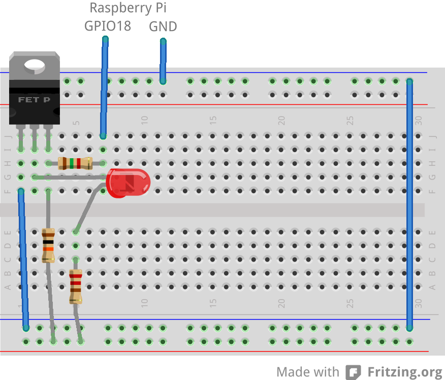

Installing onto a Raspberry Pi
==============================
Be aware that a lot of this installation process involves waiting for things to compile on the Pi. I'd have a book or similar nearby to keep you entertained :)

Install Arch
------------

Raspbian will work, but Arch is more up to date and will cause you less
headaches. Grab the latest from the [Raspberry Pi download page][] and 
install it to a sufficiently big (2GB+) SD card.

Make the FAT32 partition larger (optional)
------------------------------------------

I like to be able to take the SD card out of the Raspberry Pi and stick
it in a TV or similar device to view the videos. Most devices of this
kind require that the videos are on the first partition, and that it
must be formatted to FAT32.

You can use GNU Parted on a Linux machine (or ask a friend) to resize 
the partitions - move the EXT4 partition to the end of the device and
then expand the FAT16 partition to fill all available space (possibly 
converting it to FAT32 in the process).

[Raspberry Pi download page]: http://www.raspberrypi.org/downloads

Install the hardware
--------------------

Connect the camera to the ZIF socket.

Connect RPi GPIO17 via a resistor to a PIR motion sensor's 3V3 output (or to a button, or something else to trigger capture...)

Optionally connect the RPi GPIO18 and GND as shown below for the lighting:

Set up your OS
--------------

Append the following to your `/boot/config.txt` to enable the camera:

    start_file=start_x.elf
    fixup_file=fixup_x.dat
    # optionally:
    disable_camera_led=1

For Arch, you might like to create a pi user and install a few nice things:

    # useradd -m pi -G wheel
    # pacman -Syu
    # pacman -S vim tmux zsh grml-zsh-config sudo
    # visudo # Uncomment the NOPASSWD: ALL line
    
Don't forget to expand any partitions!

Install dependencies
--------------------

For Raspbian you may need to install a more up to date version of ffmpeg, thus why I recommend Arch.

Install:

 * git - for cloning code
 * ffmpeg - for re-encoding the videos
 * nginx - to serve the files
 * base-devel (or build-essential) - to build psips
 * python - coz that's what detect.py is written in
 * python-pip - Python's package manager
 * raspberry pi camera software

For Arch:

    # pacman -S git ffmpeg nginx base-devel python python-setuptools
    $ echo 'PATH="$PATH:/opt/vc/bin"' >> ~/.bashrc # For raspivid

Install psips:

    $ cd
    $ git clone https://github.com/AndyA/psips.git
    $ cd psips
    $ ./setup.sh
    $ ./configure && make && sudo make install
    
Install WiringPi2-Python:

    $ sudo pip install wiringpi2

Create the `/capture` folder
----------------------------

If you're putting this on the FAT32 partition (`/boot`):

    $ sudo su
    # mkdir /boot/capture
    # ln -s /boot/capture /capture
    
Otherwise:

    # sudo mkdir /capture
    
Check out this project
----------------------

I call it `motiondetector` and place it in my home directory:

    $ cd
    $ git clone https://github.com/benjie/pi-motion-recorder.git motiondetector
    $ cd motiondetector
    $ touch www/videos.txt www/log.txt
    
Install the nginx configuration:

    $ sudo mv /etc/nginx/nginx.conf /etc/nginx/nginx.conf_ORIGINAL
    $ sudo ln -s `pwd`/nginx.conf /etc/nginx
    $ sudo systemctl enable nginx
    $ sudo systemctl restart nginx
    
Fix permissions

    $ chmod +X /home/pi

Install the system service so that it starts at boot, and start it. Arch:

    $ cp motiondetector.service /etc/systemd/system
    # sudo systemctl enable motiondetector
    # sudo systemctl start motiondetector

Done!
-----

Open it up in your web browser and enjoy.
